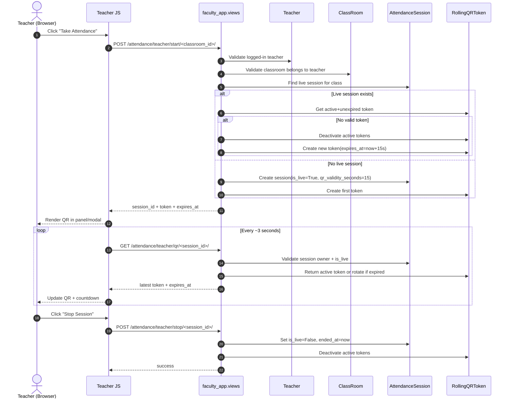
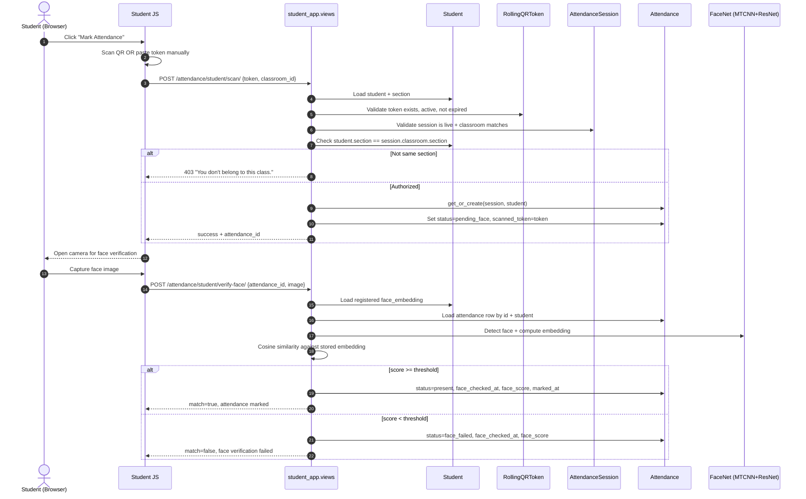

# SAMS Developer System Guide

This document explains how the system works end-to-end, with special focus on:
- facial biometric registration and verification
- rolling QR generation and validation
- model-level data flow during attendance

It is intended for new developers joining this codebase.

## 1. System Overview

SAMS is a Django app with three main modules:
- `sams_main`: authentication, OTP flow, global routes, error handlers
- `faculty_app`: teacher domain, classes, attendance sessions, rolling QR, export
- `student_app`: student domain, face registration, QR scan + face verification

Key frontend screens:
- Teacher dashboard: `templates/teacher/teacher_dashboard.html` + `static/js/teacher/dashboard.js`
- Student dashboard: `templates/student/student_dashboard.html` + `static/js/student/dashboard.js`

Timezone:
- Configured in `sams_main/settings.py` as `Asia/Kolkata`

---

## 2. Core Data Models and Relationships

## 2.1 Identity and User Mapping

- `django.contrib.auth.models.User`
  - base login account (`username`, `password`, `email`)

- `faculty_app.Teacher`
  - one-to-one with `User`
  - faculty profile used at runtime

- `faculty_app.MasterFaculty`
  - preloaded authoritative faculty list
  - faculty can register only if present here

- `student_app.Student`
  - one-to-one with `User`
  - contains roll, section mapping, and face embedding

## 2.2 Academic Structure

- `faculty_app.Section`
  - section/batch (example: `CSE-01`)
  - students belong to one section (`Student.section`)

- `faculty_app.ClassRoom`
  - one subject card assigned to one teacher and one section
  - has `start_time` and `end_time`

## 2.3 Attendance Runtime Models

- `faculty_app.AttendanceSession`
  - created when teacher clicks "Take Attendance"
  - represents one live attendance window for a classroom
  - fields: `is_live`, `started_at`, `ended_at`, `qr_validity_seconds`

- `faculty_app.RollingQRToken`
  - short-lived token linked to one `AttendanceSession`
  - rotates repeatedly (default every 15 sec)
  - only active, unexpired token is valid for scan acceptance

- `faculty_app.Attendance`
  - one row per `(session, student)` enforced by DB unique constraint
  - state machine:
    - `pending_face` (QR accepted, face not verified yet)
    - `present` (face matched)
    - `face_failed` (face mismatch)

---

## 3. Model Usage by Workflow (Sequential)

## 3.1 Teacher Starts Attendance

Entry point:
- `POST /attendance/teacher/start/<classroom_id>/`
- view: `faculty_app.views.start_attendance_session`

Behind the scenes:
1. Authenticated teacher is loaded from `Teacher`.
2. Classroom ownership is validated on `ClassRoom`:
   - class must belong to that teacher and be active.
3. System checks existing live `AttendanceSession` for that class:
   - if exists: reuse session and rotate/get token.
   - else: create new `AttendanceSession` with `is_live=True` and `qr_validity_seconds=15`.
4. Token issuance:
   - old active tokens in that session are deactivated.
   - a new `RollingQRToken` is created with `expires_at = now + 15s`.
5. API returns:
   - `session_id`, current `token`, `expires_at`, `classroom_id`.

Models touched:
- read `Teacher`
- read `ClassRoom`
- read/create `AttendanceSession`
- update/create `RollingQRToken`

## 3.2 Rolling QR Refresh Loop

Entry point:
- `GET /attendance/teacher/qr/<session_id>/`
- view: `faculty_app.views.current_qr_token`
- called repeatedly by `static/js/teacher/dashboard.js` every ~3 sec

Behind the scenes:
1. Session ownership and `is_live` are verified.
2. System tries to fetch active unexpired token.
3. If current token expired, it rotates:
   - deactivate old token(s)
   - create fresh `RollingQRToken`
4. Returns latest valid token + expiry.

Important behavior:
- teacher UI refresh frequency is independent of token validity.
- validity remains fixed by `qr_validity_seconds` on session.

Models touched:
- read `AttendanceSession`
- read/update/create `RollingQRToken`

## 3.3 Student Scans QR (Token Acceptance Phase)

Entry point:
- `POST /attendance/student/scan/`
- view: `student_app.views.scan_attendance_qr`
- called from student dashboard scanner/manual token submit

Request payload:
- `token` (string)
- `classroom_id` (selected class card id)

Behind the scenes:
1. Authenticated student is loaded from `Student` with section.
2. Token lookup on `RollingQRToken`:
   - token must exist and be `is_active=True`.
   - token must not be expired at scan time.
3. Session checks:
   - linked `AttendanceSession` must be `is_live=True`.
   - scanned `classroom_id` must match session classroom.
4. Authorization guard:
   - student section must equal session classroom section.
   - if mismatch: `"You don't belong to this class."` (403).
5. Attendance row upsert (`get_or_create`) in `Attendance`:
   - unique key `(session, student)`.
   - set `status='pending_face'`.
   - attach `scanned_token`.
6. Return `attendance_id` for next face-verification call.

Critical rule:
- QR only gates entry into attendance attempt.
- final marking depends on face match in next phase.

Models touched:
- read `Student`
- read `RollingQRToken`
- read `AttendanceSession` (through token relation)
- create/update `Attendance`

## 3.4 Student Face Verification (Final Marking Phase)

Entry point:
- `POST /attendance/student/verify-face/`
- view: `student_app.views.verify_attendance_face`

Request payload:
- `attendance_id`
- `image` (base64 data URL)

Behind the scenes:
1. Student profile is loaded and checked for registered `face_embedding`.
2. Attendance row is loaded by `attendance_id` and current student.
3. Incoming image is decoded and processed using FaceNet pipeline:
   - MTCNN face detection
   - InceptionResnetV1 embedding extraction
4. Cosine similarity computed against stored embedding.
5. Threshold check (`FACE_MATCH_THRESHOLD`, default `0.70`):
   - if pass:
     - `status='present'`
     - set `face_checked_at`, `face_score`, `marked_at`
   - if fail:
     - `status='face_failed'`
     - set `face_checked_at`, `face_score`
6. JSON response includes match result and score.

Important design point:
- face verification can happen after QR token expiry.
- only scan-time token must be valid.

Models touched:
- read `Student` (embedding source)
- read/update `Attendance`

## 3.5 Teacher Stops Session

Entry point:
- `POST /attendance/teacher/stop/<session_id>/`
- view: `faculty_app.views.stop_attendance_session`

Behind the scenes:
1. Validate teacher ownership.
2. Set session `is_live=False`, write `ended_at`.
3. Deactivate all active tokens for that session.

Models touched:
- read/update `AttendanceSession`
- update `RollingQRToken`

## 3.6 Teacher Downloads Attendance Sheet

Entry point:
- `GET /attendance/teacher/download/<classroom_id>/`
- view: `faculty_app.views.download_attendance_csv`

Behind the scenes:
1. Validates teacher ownership on `ClassRoom`.
2. Picks latest `AttendanceSession` for that class.
3. Rejects download if no attendance records exist yet.
4. Joins students of the section with attendance map.
5. Produces Excel-compatible `.xls` (HTML table) containing:
   - class, teacher, section, session metadata
   - per-student roll/name/date/time/status
   - class strength/present/absent summary
6. Filename format:
   - `<SectionCode>-<SubjectName>.xls` (sanitized)

Models touched:
- read `ClassRoom`, `Section`, `Teacher`
- read `AttendanceSession`
- read `Attendance`
- read `Student` list via section relation

---

## 4. Facial Biometrics Lifecycle

## 4.1 Student Face Registration

Entry point:
- `POST /registration/register-face/`
- view: `student_app.views.register_face`

Flow:
1. Decode base64 image from browser capture.
2. Detect face via MTCNN.
3. Generate embedding via FaceNet resnet.
4. Store embedding JSON in `Student.face_embedding`.
5. Mark `Student.face_verified=True`.
6. Also writes a local debug vector file in `facial_vectors/roll_<roll>.txt`.

Note:
- runtime attendance verification reads embedding from DB (`Student.face_embedding`), not from file.

## 4.2 Face Stack Initialization

File:
- `student_app/views.py`

Mechanism:
- models loaded lazily by `get_face_models()`
- cached globals:
  - `mtcnn`
  - `resnet`
- device auto-selected (`cuda` if available, else CPU)

---

## 5. Rolling QR Design Details

Token model:
- `RollingQRToken`
  - random unique token (`secrets.token_urlsafe(32)`)
  - `issued_at`, `expires_at`, `is_active`

Rotation behavior:
- helper `_issue_new_token(session)`:
  - deactivates existing active tokens
  - inserts one fresh token
- helper `_get_or_rotate_token(session)`:
  - returns current active+unexpired token, else rotates

Security intent:
- screenshot/share delay reduces usefulness because token quickly expires
- server always re-validates token state and expiry
- student-class authorization is enforced server-side (section check)

---

## 6. Teacher and Student UI-to-API Mapping

## 6.1 Teacher UI

Files:
- `templates/teacher/teacher_dashboard.html`
- `static/js/teacher/dashboard.js`

Actions:
- Take Attendance:
  - calls `start` endpoint
  - draws QR on canvas (plus inline panel)
  - polls `qr` endpoint every 3 sec
- Stop Session:
  - calls `stop` endpoint
- Download Attendance:
  - calls `download` endpoint
  - handles JSON error vs file blob

## 6.2 Student UI

Files:
- `templates/student/student_dashboard.html`
- `static/js/student/dashboard.js`

Actions:
- Register Facial Biometrics:
  - opens camera modal
  - posts base64 image to `/registration/register-face/`
- Mark Attendance:
  - scan QR using `html5-qrcode`, or manual token fallback
  - post token to `/attendance/student/scan/`
  - open camera again for verify step
  - post capture to `/attendance/student/verify-face/`

---

## 7. Authentication, OTP, and Registration Context

Primary auth and OTP logic:
- `sams_main/views.py`

Student registration:
1. `student_app.views.studentRegister` stores pending data + OTP in session
2. `sams_main.views.otpVerification` creates `User` + `Student` on success

Faculty registration:
1. `faculty_app.views.facultyRegister` validates against `MasterFaculty`, stores OTP context
2. `sams_main.views.otpVerification` creates `User` + `Teacher` on success

Password reset:
- handled in `sams_main.views.passwordReset` + `otpVerification`

---

## 8. Admin + Seed Data Operations

Admin registrations:
- `faculty_app/admin.py`
- `student_app/admin.py`

Useful admin actions:
- Create teacher accounts from selected `MasterFaculty`
- Delete teachers/students with linked `User` cleanup
- Insert students up to section `expected_strength`

Seed command:
- `faculty_app/management/commands/seed_demo_data.py`
- seeds teachers, sections, students, classes
- configurable counts via command arguments

---

## 9. Runtime Contracts and Constraints

Hard constraints:
- One attendance record per student per session:
  - DB unique constraint `uniq_session_student_attendance`
- Student can mark attendance only for own section class:
  - enforced in `scan_attendance_qr`

Soft/behavioral constraints:
- Download blocked until at least one attendance record exists
- Session can be stopped idempotently
- Face mismatch stays `face_failed` (manual override handled outside system)

---

## 10. API Summary (Attendance + Face)

Teacher:
- `POST /attendance/teacher/start/<classroom_id>/`
- `GET /attendance/teacher/qr/<session_id>/`
- `POST /attendance/teacher/stop/<session_id>/`
- `GET /attendance/teacher/download/<classroom_id>/`

Student:
- `POST /attendance/student/scan/`
- `POST /attendance/student/verify-face/`
- `POST /registration/register-face/`

---

## 11. Non-Production/Reference File

- `verify.py` is a standalone Flask reference prototype.
- It is not wired into Django routes and not used by runtime flows.

---

## 12. Suggested New-Dev Reading Order

1. `faculty_app/models.py`
2. `student_app/models.py`
3. `faculty_app/views.py` (attendance endpoints)
4. `student_app/views.py` (scan + face verify)
5. `templates/teacher/teacher_dashboard.html` + `static/js/teacher/dashboard.js`
6. `templates/student/student_dashboard.html` + `static/js/student/dashboard.js`
7. `sams_main/views.py` for auth/OTP context

---

## 13. Sequence Diagrams

## 13.1 Teacher Starts Attendance + Rolling QR Refresh

## 13.2 Student Attendance: QR Scan Then Face Verification

